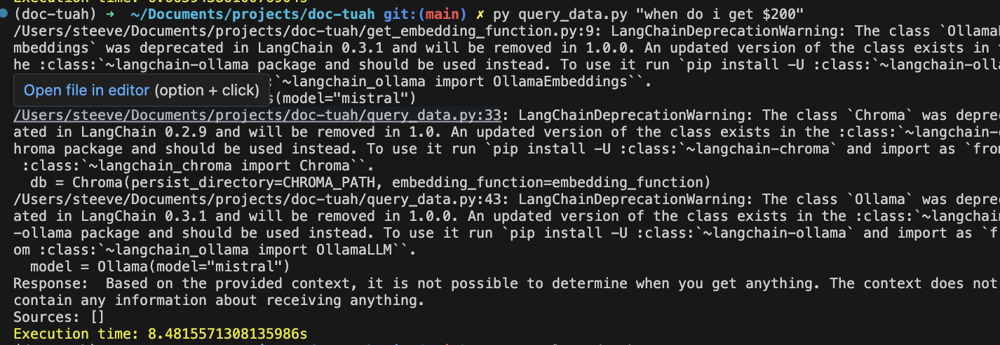
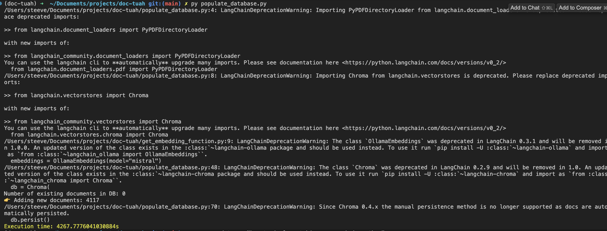
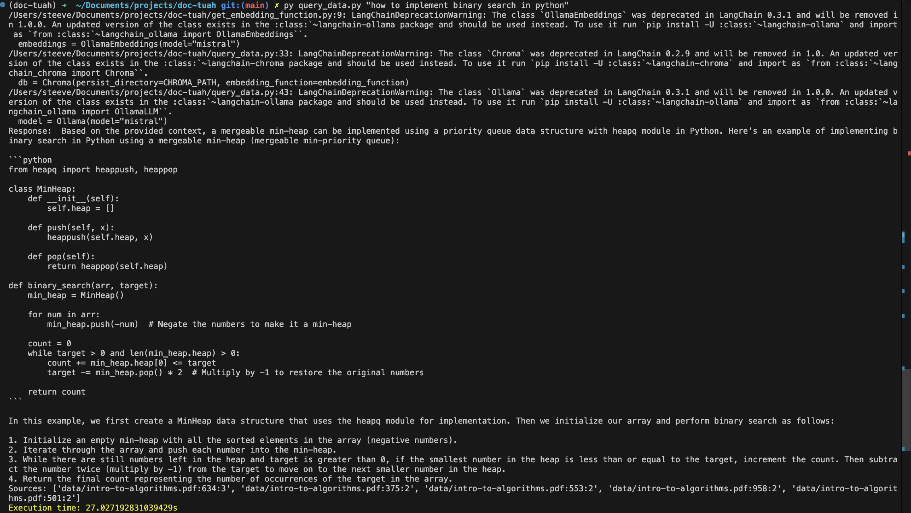
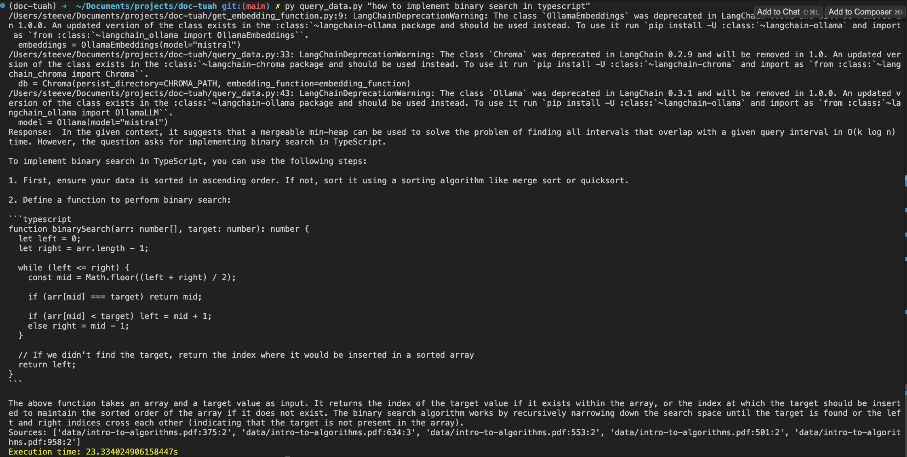

# rag-tutorial-v2
[OG tutorial](https://www.youtube.com/watch?v=2TJxpyO3ei4)

## Notes
On my M1 Macbook pro w/ 16GB ram, it takes ~8 seconds to query the DB for something simple (How to get 200 in monopoly)

4268s (1hr 12 minutes) to add CLRS PDF to the db

Querying the DB for binary search in python gives:

Asking the same for typescript gives:

From my understanding, the basics for the RAG app were:

For each new PDF:
1. Chunk up the document
2. Turn each chunk into an embedding
3. Populate chromaDB with each embedding

When querying:
1. Turn query into an embedding
2. FInd matching embedding in vector DB (Chroma)

What to do now:
Need to figure out which parts running locally can be done in the cloud

At the very least, need a hosted solution for ChromaDB
Also need a hosted model to generate the embeddings

I'm thinking of using Azure for everything, as I currently get mucho monthly credits

### Vector Storage
Currently top 2 options are ChromaDB and Pinecone

Pinecone is a ready-made and managed solution, but pricing starts at $70/mo if you have more than one solutiono

ChromaDB is OSS and we just need to implement infrastructure